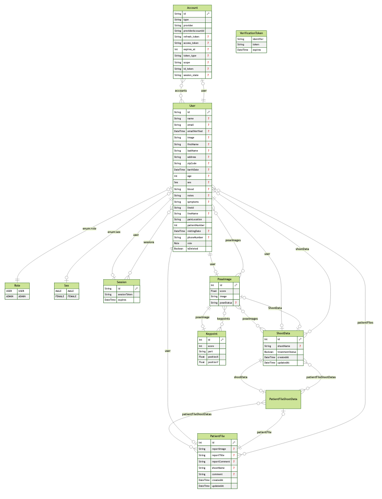

# BoneScan

## 概要

- [API 設計スプシ](https://docs.google.com/spreadsheets/d/1wccib5NqQ1K8NVQ-og_QgIniJkKDI7IjmGgEVvyiUyw/edit#gid=0)
- [Swagger api](https://editor-next.swagger.io/)

- ER 図作成 `npx prisma generate`

## T3-Stack

This is a [T3 Stack](https://create.t3.gg/) project bootstrapped with `create-t3-app`.

- [Next.js](https://nextjs.org): フロントエンドの Web アプリケーション開発フレームワークです。高速なページ遷移やサーバーサイドレンダリングなどの機能を提供します。
- [NextAuth.js](https://next-auth.js.org): 認証とセッション管理のためのライブラリです。ユーザー認証やソーシャルログインなどの機能を簡単に実装することができます。
- [Prisma](https://prisma.io): データベースアクセスと ORM（Object-Relational Mapping）を提供するツールです。データベースとの連携を容易にし、データのクエリやマイグレーションなどを管理します。
- [Tailwind CSS](https://tailwindcss.com): ユーティリティ指向の CSS フレームワークです。簡潔なクラス名を使用してスタイルを設定し、柔軟なデザインを実現します。
- [tRPC](https://trpc.io): タイプセーフな API 通信を実現するためのライブラリです。クライアントとサーバー間のデータの型安全性を確保し、エラーハンドリングなどをサポートします。
